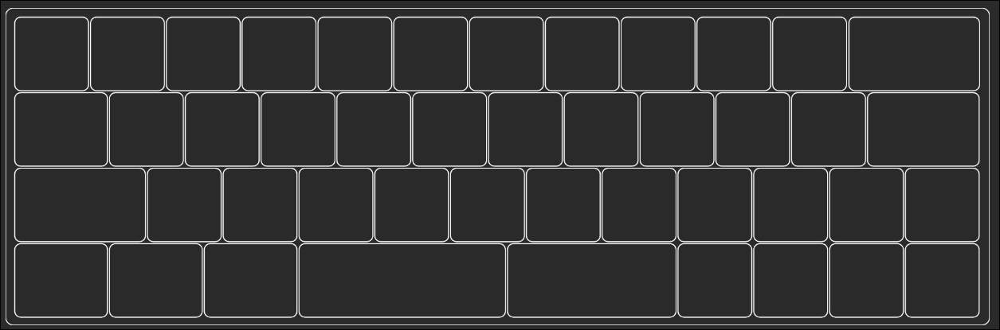


# 40% keyb

A keyb project that I completed in about 3 hours.

Made with ergogen.

zmk repo is https://github.com/theb0b12/zmk-config-fourty

INFO:
- 45 keys
- 12.75u 40% keyb
  
TODO:
- [ ] update the case with
    - [ ] pcb angle, low profile mount mcu
- [ ] build said case
    - [ ] add foam and all that
- [ ] take photos and upload them

## below is wrong
The layout

